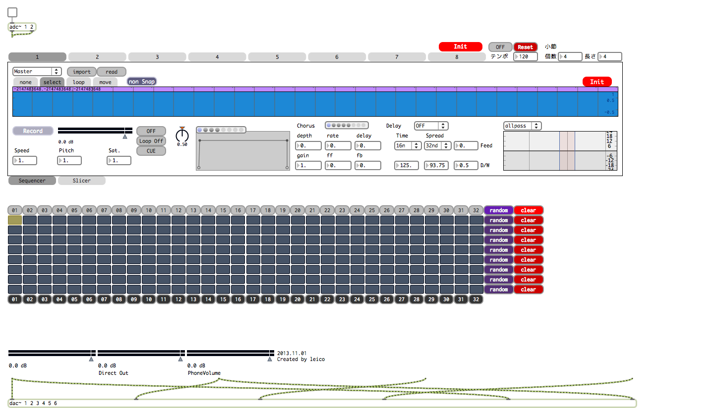

RAY.MTR
=======

8ch Sampler/Sequenser like vizzie.

can record / playback any sounds with filter/effectors.

also, you can sequensing, slicing your record sound.

CC by 2.1
http://creativecommons.org/licenses/by-sa/2.1/jp/

Created by leico

Japanese
=======

RAY.MTRについて
---
8chの録音と再生ができるパッチです。

シーケンサーやらエフェクトやらてんこ盛りです。

Max5、Max6で動作します。

エクスターナルオブジェクトは特に使用していません。

インストール手順
---
externals内のRAY.MTRフォルダをパスの通っているフォルダ(1)にインストールして下さい。

> 1.
> 
> JP:オプション -> ファイルの初期設定
> 
> EN:Options  -> File Preferences
>
> で指定されているフォルダです。

簡単な使用方法
---
sampleRAY.MTR.maxpatを開いて中のbpatcherをコピペすればどのパッチでも使用できます。

bpatcherの引数
---
bpatcherインスペクタ内のargumentsはLemurとの通信用の引数を入れています。

1. udpreceiveのポート番号
2. udpsendの送信先IP
3. udpsendの送信先ポート

